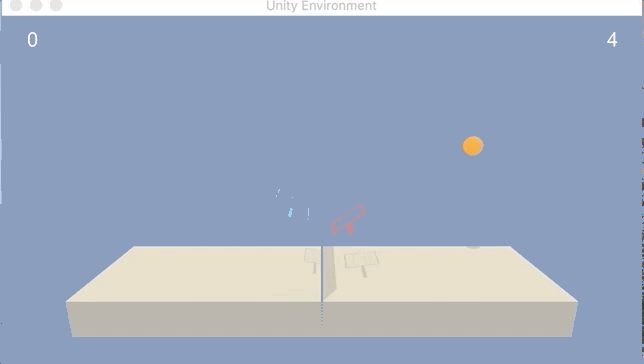

# Multi-Agent_Reinforcement
Multi-Agent_Reinforcement

# Introduction

- Before 

- After

For this project, 2 agents are trained in [Tennis](https://github.com/Unity-Technologies/ml-agents/blob/master/docs/Learning-Environment-Examples.md#tennis) environment.

If an agent hits the ball over the net, it receives a reward of +0.1. If an agent lets a ball hit the ground or hits the ball out of bounds, it receives a reward of -0.01. Thus, the goal of each agent is to keep the ball in play. Each agent receives its own, local observation. Thus, the goal of each agent is to keep the ball in play.

The observation space consists of 8 variables corresponding to the position and velocity of the ball and racket. Each agent receives its own, local observation. Two continuous actions are available, corresponding to movement toward (or away from) the net, and jumping.

# Solving the environment
The task is episodic, and in order to solve the environment, the agents must get an average score of +0.5 (over 100 consecutive episodes, after taking the maximum over both agents). Specifically,

- After each episode, we add up the rewards that each agent received (without discounting), to get a score for each agent. This yields 2 (potentially different) scores. We then take the maximum of these 2 scores.
- This yields a single score for each episode.
The environment is considered solved, when the average (a deque of 100 episodes) of those scores is at least +0.5.

# Getting Started

To run train this model you will need the below key elements:

1. [Install AI gym dependencies](https://github.com/udacity/deep-reinforcement-learning#dependencies)
2. [Install Unity environment](https://github.com/udacity/deep-reinforcement-learning#dependencies)
3. You can clone the env by running git clone https://github.com/Pytrader1x/Multi-Agent_Reinforcement
4. You can then run jupyter notebook Optimal_Continuous_Control.ipynb
The environment can be downloaded from one of the links below for all operating systems

Download the environment from one of the links below. You need only select the environment that matches your operating system:

- Linux: https://s3-us-west-1.amazonaws.com/udacity-drlnd/P3/Tennis/Tennis_Linux.zip

- Mac OSX: https://s3-us-west-1.amazonaws.com/udacity-drlnd/P3/Tennis/Tennis.app.zip

- Windows (32-bit): https://s3-us-west-1.amazonaws.com/udacity-drlnd/P3/Tennis/Tennis_Windows_x86.zip

- Windows (64-bit): https://s3-us-west-1.amazonaws.com/udacity-drlnd/P3/Tennis/Tennis_Windows_x86_64.zip

(For Windows users) Check out this link if you need help with determining if your computer is running a 32-bit version or 64-bit version of the Windows operating system.

Place the file in the root directory of GitHub repository and unzip (or decompress) the file.
