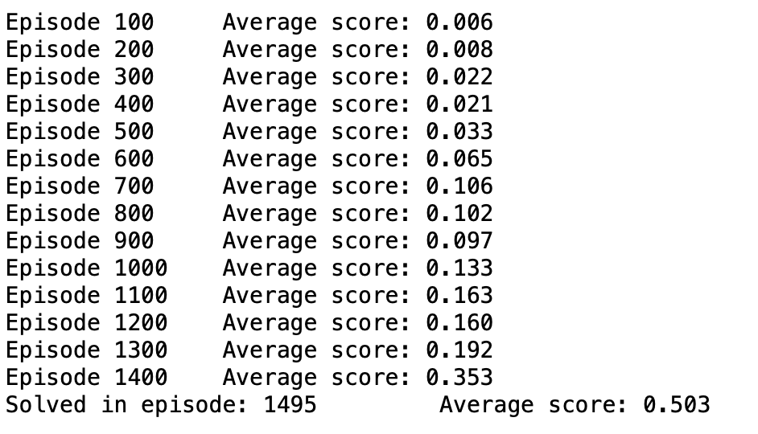

# Project Overview

To solve the environment in this project, I chose to apply the MADDPG algorithm. MADDG is a great choice for this environment due to the existence of multiple agents, and my approach here was inspired by the implementation used in the DRLND Nanodegree Lab for the physical deception environment. 

- My solution is located in [Tennis_optimal](https://github.com/Pytrader1x/Multi-Agent_Reinforcement/blob/master/Tennis_optimal.ipynb)

- One simple way to think of MADDPG is as a wrapper for handling multiple DDPG agents:

This means that there is extra information used during training that is not used during testing.

More specifically, the training process makes use of both actors and critics, just like DDPG. The difference is that the input to each agent's critic consists of all the observations and actions for all the agents combined.

Since only the actor is present during testing, that extra information used during training effectively goes away.

This framework makes MADDPG flexible enough to handle competitive, collaborative, and mixed environments.

# Hyperparameters

- BUFFER_SIZE = int(1e5)  # replay buffer size

- BATCH_SIZE = 300         # minibatch size

- GAMMA = 0.99            # discount factor

- TAU = 1e-3              # for soft update of target parameters

- LR_ACTOR = 1e-4         # learning rate of the actor

- LR_CRITIC = 1e-3        # learning rate of the critic 2539

- WEIGHT_DECAY = 0        # L2 weight decay

# Results

- I solved this challenge in 1495 Episodes with an average score of 0.503

# Base state

# Algorithm used and methods

- To solve the environment, the agents must get an average score of +0.5 over 100 consecutive episodes, 
after taking the maximum over both agents. Algorithms and Techniques 

To train the Tennis agents I used MDDGP algorithm implementing centralized training and decentralized execution. 
Each agent receives its own, local observation. 

Thus it will be possible to simultaneously train both agents through self-play. 

During training, the critic for each agent uses extra information like states observed and actions taken by all other agents.

For the actor, there is one for each agent. 

Each actor has access to only its agents observations and actions. 

During execution time only actors are present and all observations and actions are used. 

MADDPG (Multi-agent DDPG) class uses 2 DDPG agents similar to what was used in Udacity classroom 
for previous projects. Also ReplayBuffer is used as a shared buffer between agents. 

MADDPG combines states, actions, rewards, next_states, dones from both agents and adds them to shared ReplayBuffer. 

- MADDPG act calls act for 2 DDPG agents. 

- The Actor network consists of 3 linear layers. 

- The first 2 linear layers are followed by Relu layer and the 3rd linear layer is followed by a Tanh 
layer as output layer. 

- The sizes for the layers are 24 200, 200*150 and 150*2 respectively. 

- The Critic has a similar structure with sizes of 52*200, 200*150 and 150*1. 

- Environment was solved in 2186 

episodes and the network weights for 2 agents were saved as agent1_checkpoint_actor.pth, 

agent1_checkpoint_critic.pth, agent2_checkpoint_actor.pth and agent2_checkpoint_critic.pth. 

For different trials the number of episodes to solve the environment was usually around 2000.

Trained Models

- The agent1_checkpoint_actor.pth file represents the first agent actor
- The agent1_checkpoint_critic.pth file represents the first agent critic
- The agent2_checkpoint_actor.pth file represents the second agent actor
- The agent2_checkpoint_critic.pth file represents the second agent critic

# Further Improvements

The following techniques can be tried out to further improve the performance of the network

- Optimise the hyperparameters to get it to converge faster with a score of greater that 0.55
- I would also like to explore further prioritized experience replay: This technique prioritizes the experiences and chooses the best experience for further training when sampling from the buffer.
This is known to reduce the training time and make the training more efficient.

- Furthermore I'd like to go deeper in checking howAsynchornous Actor Critic Agents can help further improve convergence: This procedure prepares different specialist operators that interface with a glocal arrange nonconcurrently to upgrade the approach and worth capacity. Thusly, every one of these operators connects with it's own duplicate of the earth simultaneously as different specialists are communicating with their surroundings.
